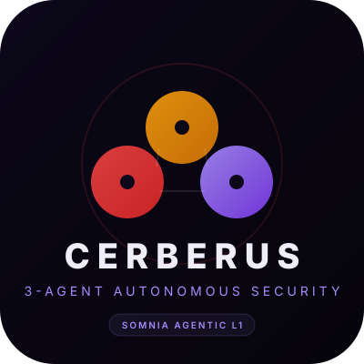
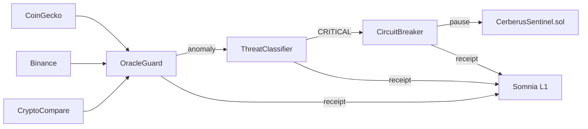

# Cerberus — 3-Agent Autonomous Security

### Somnia Agentathon 2026



---

## The Problem

**Smart contracts have no immune system.**

- Oracles get manipulated — nobody notices
- Price feeds diverge — funds drain before humans react
- Exploits happen in seconds, responses take hours

> "Who watches the watchers?"

---

## The Solution:

**Three AI agents. One 60-second heartbeat. Zero trust.**

```
📡 OracleGuard      →  detects anomalies in 3 price feeds
🧠 ThreatClassifier  →  deterministic LLM classifies threat
⚡ CircuitBreaker    →  auto-pauses compromised contracts
```

Every decision = verifiable receipt on Somnia Agentic L1.

---

## Architecture



**Somnia primitives used:** JSON API Request + LLM Inference + Verifiable Receipts

---

## Live Dashboard

- **Overview** — 6 metric cards, ETH/USD price, pipeline status
- **Agent Pipeline** — 3 agent detail cards with Somnia primitive badges
- **Event Log** — color-coded, filterable (Critical/Medium/OracleGuard/Errors)
- **About** — wallet, contract, chain, RPC info

One-click anomaly simulation for demo. Auto-refresh 2s.

---

## Why This Wins

| Criterion | How Cerberus Delivers |
|---|---|
| **Agent-First** | Agents discover, classify, act — no human in loop |
| **Innovation** | Deterministic LLM for security classification (first of its kind) |
| **Autonomous** | 60s heartbeat, self-healing, runs forever |
| **Functionality** | Working prototype, 3 live price feeds, deployed on Railway |

---

## Links

- **GitHub:** https://github.com/Gideon145/cerberus
- **Live Demo:** https://cerberus-production-8429.up.railway.app
- **CV:** [Opukeme-Gideon-Somnia.pdf](./CV-Opukeme-Gideon-Somnia.pdf)

Built in 3 days by a solo developer for the Somnia Agentathon.
